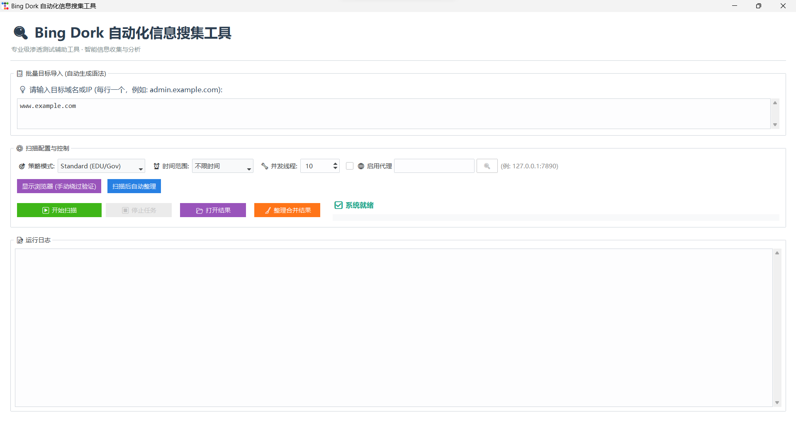
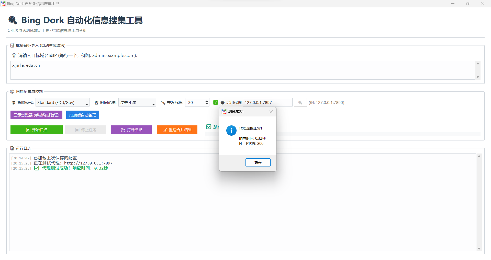
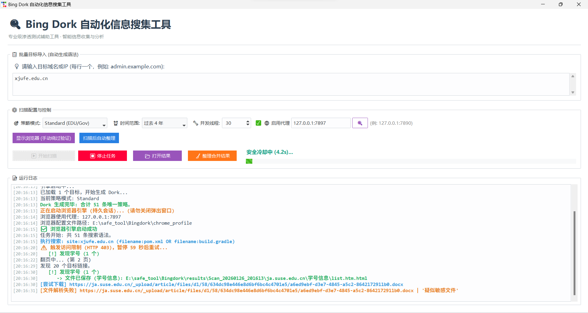
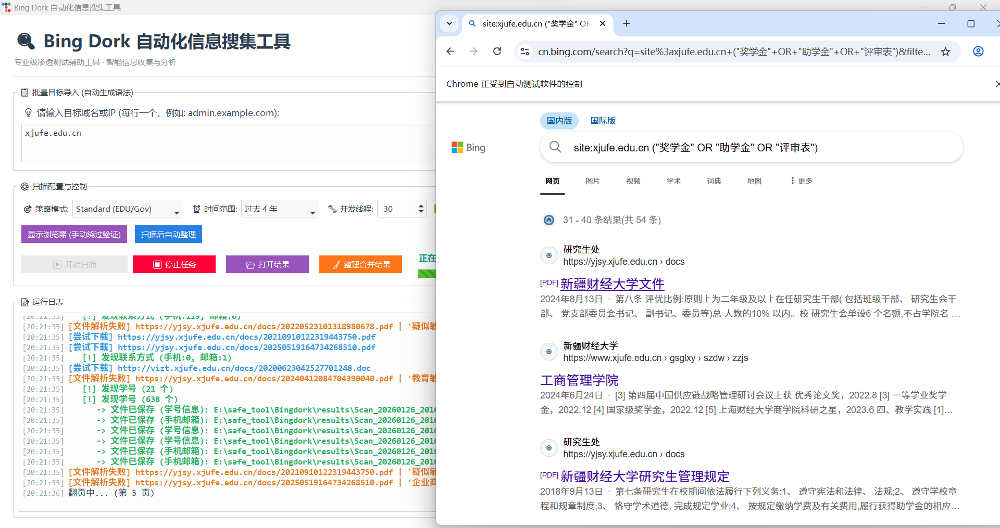
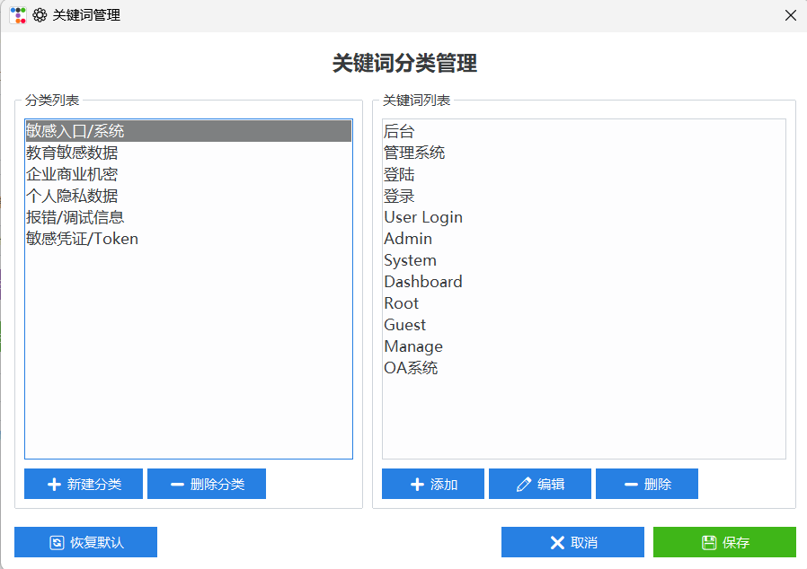

# LeakDetector (Bing Dork Automation Tool)

  

**LeakDetector** 是一款专为红队渗透测试人员和安全研究员设计的**自动化信息泄露侦察工具**。它基于 Bing 搜索引擎的高级语法（Dork），结合 Playwright 浏览器自动化技术，能够高效、精准地发现互联网上由于配置不当、运维疏忽或系统漏洞而暴露的敏感信息。

与传统脚本不同，LeakDetector 引入了**智能抗反爬机制**和**深度内容分析引擎**，支持从数千个结果中自动筛选出高价值的敏感文件（如 Excel 通讯录、身份证名单、API 密钥配置等），并自动生成可视化的审计报告。

> **⚠️ 免责声明 / Legal Disclaimer**
>
> 本工具仅供授权的安全测试、漏洞挖掘和企业内部安全审计使用。严禁用于非法入侵、数据窃取或任何未经授权的恶意攻击活动。使用者应自行承担因使用本工具而产生的一切法律责任。

---

## ✨ 核心特性 (Key Features)

### 1. 🛡️ 多维度 Dork 侦察策略

内置经过实战验证的六层侦察策略 (P1-P6)，覆盖从基础设施到敏感数据的全方位检测：

* **API & 配置泄露**: 自动发现 Swagger UI, Spring Boot Actuator, `.env`, `application.yml` 等关键配置。
* **精准文件挖掘**: 专注于 `xlsx`, `docx`, `pdf` 等文档，智能识别包含“身份证”、“手机号”、“工资表”等敏感词的文件。
* **后台与组件识别**: 快速定位 OA 系统 (泛微/致远)、后台管理入口、Jenkins/GitLab 等运维平台。
* **漏洞特征探测**: 识别 SQL 注入报错页面、文件上传入口、Webshell 残留等高危特征。

### 2. 🧠 智能浏览器引擎 (Smart Browser Engine)

集成 **Playwright** 浏览器内核，彻底解决传统爬虫面临的难题：

* **自动/手动绕过验证码**: 支持检测 Bing 的 Turnstile/ReCAPTCHA 验证，支持在 GUI 中自动暂停并引导用户手动过验证，**彻底解决 IP 封禁导致的无结果问题**。
* **动态渲染抓取**: 能够处理依赖 JavaScript 加载的搜索结果，获取比纯 HTTP 请求更完整的数据。

### 3. 🔍 深度内容分析与提取 (Deep Analysis)

不仅是简单的链接收集，工具会对下载的文件进行深度解析：

* **Excel/CSV/PDF 解析**: 自动下载并读取文档内容（支持多 Sheet 识别）。
* **敏感信息正则提取**: 内置中国大陆身份证、手机号、邮箱、学号等精准正则，自动从海量文本中提取 PII (个人隐私信息)。
* **风险评分系统**: 根据泄露信息的类型和数量，自动计算并在报告中通过颜色标记高危条目。

### 4. ⚡ 高性能并发架构

* 采用 `ThreadPoolExecutor` 线程池架构，支持 10-50 线程并发扫描。
* **Pipeline 流水线设计**: 搜索线程与分析线程分离，实现“边搜边解”，大幅缩短任务总耗时。

### 5. ⚙️ 可视化关键词管理

* **GUI 关键词编辑器**: 通过图形化界面轻松管理敏感信息检测关键词。
* **分类管理**: 内置6大预设分类(敏感入口、教育数据、商业机密、个人隐私、调试信息、凭证Token)。
* **自定义扩展**: 支持新建分类、添加/编辑/删除关键词,配置自动保存至 `keywords.json`。
* **一键恢复**: 提供"恢复默认"功能,方便重置配置。

### 6. 📊 智能数据整理

* **自动补全下载**: 扫描结束后自动检测报告中未下载的文件链接并补全。
* **多格式解析**: 支持 Excel、CSV、PDF、HTML 等多种文件格式的并行解析。
* **数据去重与分类**: 自动合并、去重,按敏感信息类型分类汇总。
* **垃圾过滤**: 智能过滤超长文本列,保留高价值数据。

---

## 🛠️ 侦察策略详解 (Dork Strategies)

LeakDetector 将搜索语法分为 6 个优先级，用户可根据场景选择：

| 级别   | 策略名称               | 描述                                             | 典型语法示例                                                 |
| :----- | :--------------------- | :----------------------------------------------- | :----------------------------------------------------------- |
| **P1** | **基础设施 & API**     | **[必跑]** 核心配置与接口暴露，杀伤力最大。      | `inurl:swagger`, `inurl:actuator/env`, `filename:pom.xml`    |
| **P2** | **精准文件泄露**       | **[高危]** 针对 Excel/PDF 的精准打击，提取 PII。 | `filetype:xlsx "通讯录"`, `filetype:xlsx "身份证"`           |
| **P3** | **后台与 OA**          | 企业级后台入口、SSO 认证、OA 系统。              | `inurl:login`, `inurl:seeyon` (致远), `inurl:weaver` (泛微)  |
| **P4** | **行业特征 (Edu/Gov)** | 针对学校/政府的特有敏感词。                      | `"教务系统"`, `"录取名单"`, `"中标公告"`, `filetype:xlsx "学号"` |
| **P5** | **漏洞技术细节**       | SQL 注入报错、Webshell、上传点、源码泄露。       | `inurl:php?id=`, `intext:"sql syntax near"`, `ext:sql`       |
| **P6** | **运维与云设施**       | DevOps 平台、VPN 入口、云存储密钥。              | `inurl:jenkins`, `filename:id_rsa`, `filename:web.config`    |

---

## 🚀 快速开始 Guide (EXE 版本)

本工具已打包为独立的 `LeakDetector.exe`，无需安装 Python 或依赖库。

### 1. 启动

直接双击 `LeakDetector.exe` 即可启动图形化界面。

### 2. 基础配置

1. **输入目标**: 在主界面的文本框中输入**根域名**，支持批量导入。

   > *示例*:
   > `example.com`
   > `university.edu.cn`

2. **选择模式**:

   * **Standard (EDU/Gov)**: 适合教育、政府目标，侧重文档泄露和 PII 提取。
   * **Enterprise**: 适合企业目标，侧重后台、OA、DevOps 暴露。
   * **All**: 执行所有 P1-P6 策略（耗时较长）。

3. **开始运行**: 点击 `▶ 开始扫描` 按钮。

### 3. 进阶功能：浏览器模式 (强烈推荐)

默认情况下工具使用 HTTP 请求模式（速度快但易被封）。建议开启 **"显示浏览器 (手动绕过验证)"**:

1. 勾选界面上的 `显示浏览器` 复选框。
2. 工具会自动启动一个 Chrome / Edge 窗口。
3. **不要关闭该窗口**。当遇到 Bing 验证码时，工具会暂停并弹窗提示。
4. 您只需在浏览器中手动完成滑块验证，然后点击工具弹窗的 `确定`，扫描将自动继续。

---

## ⚙️ 配置文件说明 (`config.json`)

工具首次运行后会在同级目录生成 `config.json`，可修改高级选项：

```json
{
    "proxy_enabled": true,            // 是否默认启用代理
    "proxy_url": "127.0.0.1:7890",    // 代理地址 (HTTP/Socks5)
    "use_browser": false,             // 默认是否开启浏览器模式
    "max_threads": 10,                // 扫描并发线程数 (建议 5-20)
    "time_range": "不限时间",          // 默认时间过滤 (过去24h/1周/1月等)
    "auto_organize": false            // 扫描结束后是否自动整理结果文件夹
}
```

### 关键词配置 (`keywords.json`)

工具支持自定义敏感信息检测关键词,配置文件在首次使用"关键词管理"功能后自动生成:

```json
{
  "敏感入口/系统": ["后台", "管理系统", "登录", "Admin", ...],
  "教育敏感数据": ["学号", "录取", "成绩单", ...],
  "企业商业机密": ["合同", "薪资", "工资", ...],
  "个人隐私数据": ["身份证", "手机号", "通讯录", ...],
  "报错/调试信息": ["SQL syntax", "Fatal error", ...],
  "敏感凭证/Token": ["api_key", "access_token", ...]
}
```

**推荐方式**: 点击主界面的 `⚙️ 关键词管理` 按钮,通过可视化界面进行编辑。

---

## 📸 运行截图 (Screenshots)

### 1. 主界面与配置


*简洁直观的操作界面，支持批量目标导入与策略选择*

### 2. 自动化扫描


*实时显示扫描进度与发现的高危目标*

### 3. 结果分析


*自动提取 Excel/PDF 中的敏感信息，并进行风险分级*

### 4. 浏览器模式 (Bypass CAPTCHA)


*直观的浏览器视图,辅助通过复杂的人机验证*

### 5. 关键词管理


*可视化关键词管理界面,支持自定义敏感信息检测规则*

## 📊 输出报告解读

扫描结果保存在 `results/Scan_YYYYMMDD_HHMMSS/` 目录下：

* **`信息泄露扫描报告_xxx.xlsx`**: 核心产出物。
  * **汇总详情页**: 包含所有发现的高危条目，按风险评分排序。
  * **扫描概览页**: 各类风险的数量统计、高危域名 Top20 分布。
  * **风险评分**: 红色背景为极高危（身份证/密码），黄色为中危（邮箱/手机）。
* **下载的文件**: 扫描过程中自动下载的 `.xlsx`, `.pdf` 等原始文件会保存在对应文件夹中，供人工取证。

---

## 📝 常见问题 (FAQ)

**Q1: 为什么扫描结果很少或为 0？**

* **原因 A**: 目标本身安全性较好，无外网暴露信息。
* **原因 B (最常见)**: Bing 对 IP 进行了风控，导致 API 请求返回空或 403。
* **解决方案**: **务必开启 "显示浏览器" 模式**，并配合代理池或稳定的梯子使用。浏览器模式能模拟真实用户指纹，极大提高成功率。

**Q2: 浏览器模式启动报错？**

* 工具依赖 Playwright，需要系统安装有 Chrome 或 Edge 浏览器。
* 如果报错 `Executable doesn't exist`，请检查浏览器是否安装在默认路径。

**Q3: 代理连接失败？**

* 请确保代理地址格式正确 (如 `127.0.0.1:7890`) 且代理软件允许局域网/本机连接。
* 支持 HTTP 和 Socks5 协议。

**Q4: 如何自定义敏感信息检测规则？**

* 点击主界面的 `⚙️ 关键词管理` 按钮,打开可视化编辑器。
* 可以添加、编辑、删除关键词,或创建新的分类。
* 修改后点击"保存"按钮,配置会自动保存到 `keywords.json`,下次扫描立即生效。
* 如需恢复默认配置,点击"恢复默认"按钮即可。

**Q5: PDF 文件解析失败？**

* 工具已集成 `pdfplumber` 库,支持自动解析 PDF 内容。
* 如果看到日志中显示"文件解析失败"但后面跟着分类名称(如 '教育敏感数据'),这实际上表示文件已成功解析并检测到敏感信息,只是日志显示不够直观。

---

## 🔗 关于

**作者**: bug_001
