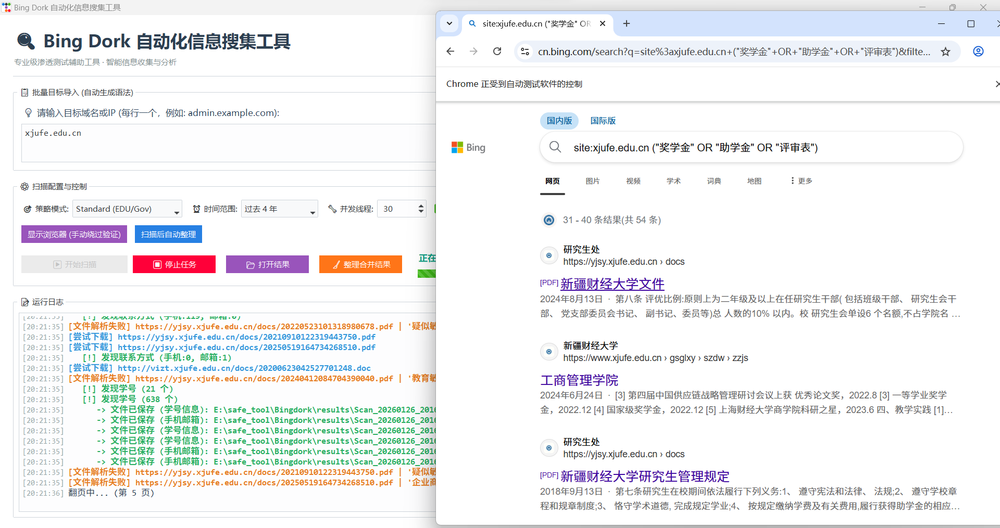
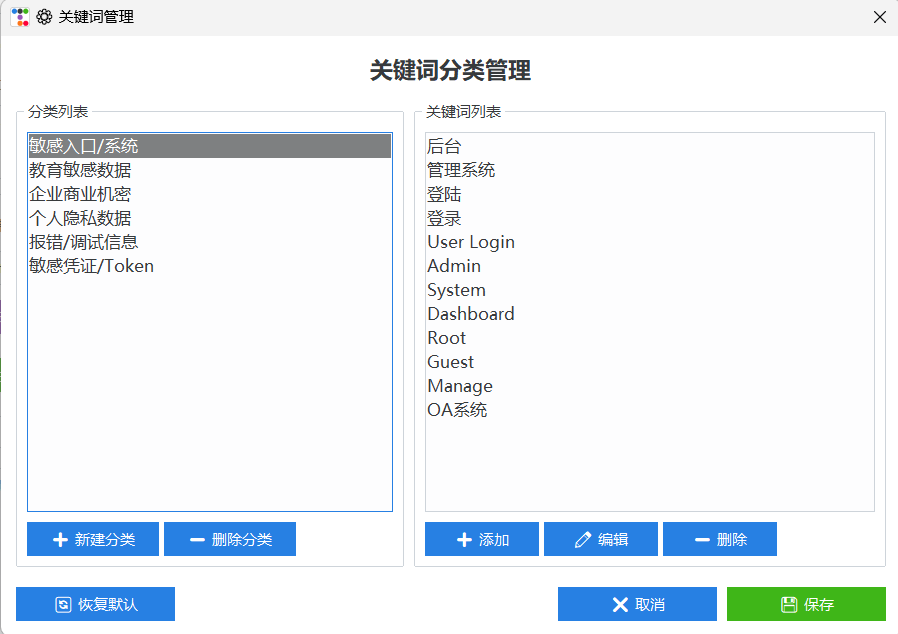

* 采用 `ThreadPoolExecutor` 线程池架构，支持 10-50 线程并发扫描。
* **Pipeline 流水线设计**: 搜索线程与分析线程分离，实现“边搜边解”，大幅缩短任务总耗时。

### 5. ⚙️ 可视化关键词管理

* **GUI 关键词编辑器**: 通过图形化界面轻松管理敏感信息检测关键词。
* **分类管理**: 内置6大预设分类(敏感入口、教育数据、商业机密、个人隐私、调试信息、凭证Token)。
* **自定义扩展**: 支持新建分类、添加/编辑/删除关键词,配置自动保存至 `keywords.json`。
* **一键恢复**: 提供"恢复默认"功能,方便重置配置。

### 6. 📊 智能数据整理

* **自动补全下载**: 扫描结束后自动检测报告中未下载的文件链接并补全。
* **多格式解析**: 支持 Excel、CSV、PDF、HTML 等多种文件格式的并行解析。
* **数据去重与分类**: 自动合并、去重,按敏感信息类型分类汇总。
* **垃圾过滤**: 智能过滤超长文本列,保留高价值数据。

---

## 🛠️ 侦察策略详解 (Dork Strategies)

LeakDetector 将搜索语法分为 6 个优先级，用户可根据场景选择：

| 级别 | 策略名称 | 描述 | 典型语法示例 |
| :--- | :--- | :--- | :--- |
| **P1** | **基础设施 & API** | **[必跑]** 核心配置与接口暴露，杀伤力最大。 | `inurl:swagger`, `inurl:actuator/env`, `filename:pom.xml` |
| **P2** | **精准文件泄露** | **[高危]** 针对 Excel/PDF 的精准打击，提取 PII。 | `filetype:xlsx "通讯录"`, `filetype:xlsx "身份证"` |
| **P3** | **后台与 OA** | 企业级后台入口、SSO 认证、OA 系统。 | `inurl:login`, `inurl:seeyon` (致远), `inurl:weaver` (泛微) |
| **P4** | **行业特征 (Edu/Gov)** | 针对学校/政府的特有敏感词。 | `"教务系统"`, `"录取名单"`, `"中标公告"`, `filetype:xlsx "学号"` |
| **P5** | **漏洞技术细节** | SQL 注入报错、Webshell、上传点、源码泄露。 | `inurl:php?id=`, `intext:"sql syntax near"`, `ext:sql` |
| **P6** | **运维与云设施** | DevOps 平台、VPN 入口、云存储密钥。 | `inurl:jenkins`, `filename:id_rsa`, `filename:web.config` |
| 级别   | 策略名称               | 描述                                             | 典型语法示例                                                 |
| :----- | :--------------------- | :----------------------------------------------- | :----------------------------------------------------------- |
| **P1** | **基础设施 & API**     | **[必跑]** 核心配置与接口暴露，杀伤力最大。      | `inurl:swagger`, `inurl:actuator/env`, `filename:pom.xml`    |
| **P2** | **精准文件泄露**       | **[高危]** 针对 Excel/PDF 的精准打击，提取 PII。 | `filetype:xlsx "通讯录"`, `filetype:xlsx "身份证"`           |
| **P3** | **后台与 OA**          | 企业级后台入口、SSO 认证、OA 系统。              | `inurl:login`, `inurl:seeyon` (致远), `inurl:weaver` (泛微)  |
| **P4** | **行业特征 (Edu/Gov)** | 针对学校/政府的特有敏感词。                      | `"教务系统"`, `"录取名单"`, `"中标公告"`, `filetype:xlsx "学号"` |
| **P5** | **漏洞技术细节**       | SQL 注入报错、Webshell、上传点、源码泄露。       | `inurl:php?id=`, `intext:"sql syntax near"`, `ext:sql`       |
| **P6** | **运维与云设施**       | DevOps 平台、VPN 入口、云存储密钥。              | `inurl:jenkins`, `filename:id_rsa`, `filename:web.config`    |

---

@@ -71,13 +85,17 @@ LeakDetector 将搜索语法分为 6 个优先级，用户可根据场景选择
### 2. 基础配置

1. **输入目标**: 在主界面的文本框中输入**根域名**，支持批量导入。
    > *示例*:
    > `example.com`
    > `university.edu.cn`

   > *示例*:
   > `example.com`
   > `university.edu.cn`

2. **选择模式**:
    * **Standard (EDU/Gov)**: 适合教育、政府目标，侧重文档泄露和 PII 提取。
    * **Enterprise**: 适合企业目标，侧重后台、OA、DevOps 暴露。
    * **All**: 执行所有 P1-P6 策略（耗时较长）。

   * **Standard (EDU/Gov)**: 适合教育、政府目标，侧重文档泄露和 PII 提取。
   * **Enterprise**: 适合企业目标，侧重后台、OA、DevOps 暴露。
   * **All**: 执行所有 P1-P6 策略（耗时较长）。

3. **开始运行**: 点击 `▶ 开始扫描` 按钮。

### 3. 进阶功能：浏览器模式 (强烈推荐)
@@ -106,6 +124,23 @@ LeakDetector 将搜索语法分为 6 个优先级，用户可根据场景选择
}
```

### 关键词配置 (`keywords.json`)

工具支持自定义敏感信息检测关键词,配置文件在首次使用"关键词管理"功能后自动生成:

```json
{
  "敏感入口/系统": ["后台", "管理系统", "登录", "Admin", ...],
  "教育敏感数据": ["学号", "录取", "成绩单", ...],
  "企业商业机密": ["合同", "薪资", "工资", ...],
  "个人隐私数据": ["身份证", "手机号", "通讯录", ...],
  "报错/调试信息": ["SQL syntax", "Fatal error", ...],
  "敏感凭证/Token": ["api_key", "access_token", ...]
}
```

**推荐方式**: 点击主界面的 `⚙️ 关键词管理` 按钮,通过可视化界面进行编辑。

---

## 📸 运行截图 (Screenshots)
@@ -128,7 +163,12 @@ LeakDetector 将搜索语法分为 6 个优先级，用户可根据场景选择
### 4. 浏览器模式 (Bypass CAPTCHA)


*直观的浏览器视图，辅助通过复杂的人机验证*
*直观的浏览器视图,辅助通过复杂的人机验证*

### 5. 关键词管理


*可视化关键词管理界面,支持自定义敏感信息检测规则*

## 📊 输出报告解读

@@ -157,10 +197,23 @@ LeakDetector 将搜索语法分为 6 个优先级，用户可根据场景选择

**Q3: 代理连接失败？**

* 请确保代理地址格式正确 (如 `http://127.0.0.1:7890、Socks5://127.0.0.1:7890`) 且代理软件允许局域网/本机连接。
* 请确保代理地址格式正确 (如 `127.0.0.1:7890`) 且代理软件允许局域网/本机连接。
* 支持 HTTP 和 Socks5 协议。

**Q4: 如何自定义敏感信息检测规则？**

* 点击主界面的 `⚙️ 关键词管理` 按钮,打开可视化编辑器。
* 可以添加、编辑、删除关键词,或创建新的分类。
* 修改后点击"保存"按钮,配置会自动保存到 `keywords.json`,下次扫描立即生效。
* 如需恢复默认配置,点击"恢复默认"按钮即可。

**Q5: PDF 文件解析失败？**

* 工具已集成 `pdfplumber` 库,支持自动解析 PDF 内容。
* 如果看到日志中显示"文件解析失败"但后面跟着分类名称(如 '教育敏感数据'),这实际上表示文件已成功解析并检测到敏感信息,只是日志显示不够直观。

---

## 🔗 关于

版本: v1.0.0 作者：bug_001
**作者**: bug_001
